Analyzing Bd genotype data in R
================

Before running this script I first did a few steps call SNPS from our
data. I aligned the raw sequencing reads to a set of reference alleles
using the program bwa-mem, then called variants using the
haplotype-based caller Freebayes. Variants were then filtered using to
only include variants with a minor allele frequency \> 0.01, quality \>
30, less than 10% missing data, and minimum depth of 5. There are plenty
of tutorials out there to get from raw reads to filtered variants. But
for the sake of time let’s just start with out filtered variants in the
form of a .vcf file.

Let’s start with installing and loading the packages we will need.

First we read in our variant call file (VCF) and match it to a metadata
table that contains information about our samples.

``` r
#read in vcf calculated using freebayes
Bd.VCF <- read.vcfR("delia_freebayes_mexico.vcf")
```

    ## Scanning file to determine attributes.
    ## File attributes:
    ##   meta lines: 295
    ##   header_line: 296
    ##   variant count: 761
    ##   column count: 100
    ## Meta line 295 read in.
    ## All meta lines processed.
    ## gt matrix initialized.
    ## Character matrix gt created.
    ##   Character matrix gt rows: 761
    ##   Character matrix gt cols: 100
    ##   skip: 0
    ##   nrows: 761
    ##   row_num: 0
    ## Processed variant: 761
    ## All variants processed

``` r
#read in file with sample metadata
Bd.meta <- read_csv(file = "delia_mexico_metadata.csv")
```

    ## 
    ## ── Column specification ────────────────────────────────────────────────────────
    ## cols(
    ##   Sample_ID = col_character(),
    ##   Species = col_character(),
    ##   Genus = col_character(),
    ##   Family = col_character(),
    ##   Order = col_character(),
    ##   Type = col_character(),
    ##   State = col_character(),
    ##   Lat = col_double(),
    ##   Lon = col_double(),
    ##   GPL_lineage = col_double(),
    ##   Collection_year = col_double()
    ## )

``` r
#join in a metadata table based on sample ID
colnames(Bd.VCF@gt)[-1] -> vcf.names
as.data.frame(vcf.names) -> vcf.names
colnames(vcf.names) <- "Sample_ID"
left_join(vcf.names, Bd.meta, by = "Sample_ID") -> vcf.meta
#check to make sure all samples in the vcf are now in the metadata table
all(colnames(Bd.VCF@gt)[-1] == vcf.meta$Sample)
```

    ## [1] TRUE

Now we are going to turn the VCF into a genlight object for downstream
calculations.

``` r
gl.Bd <- vcfR2genlight(Bd.VCF)
```

    ## Warning in vcfR2genlight(Bd.VCF): Found 17 loci with more than two alleles.
    ## Objects of class genlight only support loci with two alleles.
    ## 17 loci will be omitted from the genlight object.

``` r
ploidy(gl.Bd) <- 2
#get summary of data
gl.Bd
```

    ##  /// GENLIGHT OBJECT /////////
    ## 
    ##  // 91 genotypes,  744 binary SNPs, size: 239.8 Kb
    ##  3320 (4.9 %) missing data
    ## 
    ##  // Basic content
    ##    @gen: list of 91 SNPbin
    ##    @ploidy: ploidy of each individual  (range: 2-2)
    ## 
    ##  // Optional content
    ##    @ind.names:  91 individual labels
    ##    @loc.names:  744 locus labels
    ##    @chromosome: factor storing chromosomes of the SNPs
    ##    @position: integer storing positions of the SNPs
    ##    @other: a list containing: elements without names

``` r
#looks like we have 91 samples and 744 loci
```

**Using DAPC to assign our genetic samples to different clusters**

Now we are going to use a discriminant analysis of principal components
(DAPC) to identify clusters within our genetic data using the package
adegenet.

``` r
#this finds the optimal number of clusters for us
set.seed(1989)
grp <- find.clusters(gl.Bd, max.n.clust=10, n.pca = 100, choose.n.clust = F, criterion = "diffNgroup")

#now we can look at the BIC plot to see how we choose our K=5
#we are looking for the "elbow" in the chart - were the decrease in BIC levels off
plot(grp$Kstat, type="b", col="blue", ylab="BIC")
```

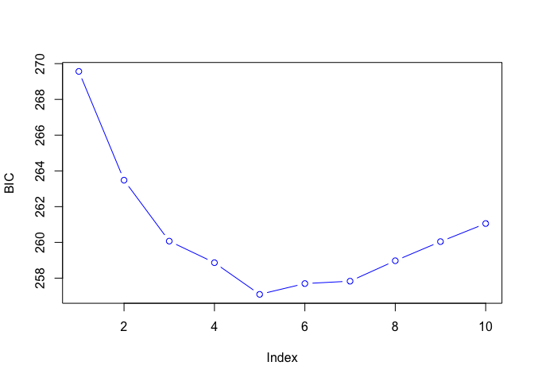<!-- -->

Let’s run the DAPC with lots of PCs and see what we get.

``` r
#run with 50 PCs 
dapc1 <- dapc(gl.Bd, grp$grp, n.pca=50, n.da=2)

summary(dapc1)
```

    ## $n.dim
    ## [1] 2
    ## 
    ## $n.pop
    ## [1] 5
    ## 
    ## $assign.prop
    ## [1] 0.8901099
    ## 
    ## $assign.per.pop
    ##         1         2         3         4         5 
    ## 1.0000000 1.0000000 0.9148936 1.0000000 0.7000000 
    ## 
    ## $prior.grp.size
    ## 
    ##  1  2  3  4  5 
    ## 10  4 47 10 20 
    ## 
    ## $post.grp.size
    ## 
    ##  1  2  3  4  5 
    ## 10  4 49 10 18

``` r
scatter(dapc1)
```

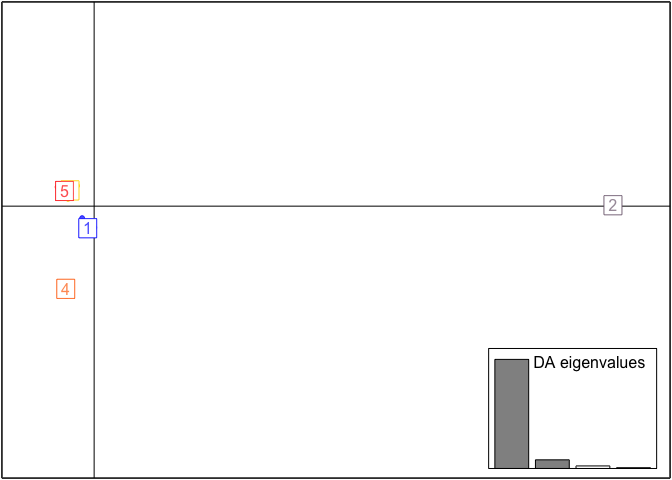<!-- -->

Wow looks like we have four close groups and one that is very
different\! BUT this may be due to overfitting because we are using so
many PCs for the calculation. So lets find out how many PCs we should
use with the optim.a.score function.

``` r
#then use this to find the optimal number of PCs to use
temp <- optim.a.score(dapc1)
```

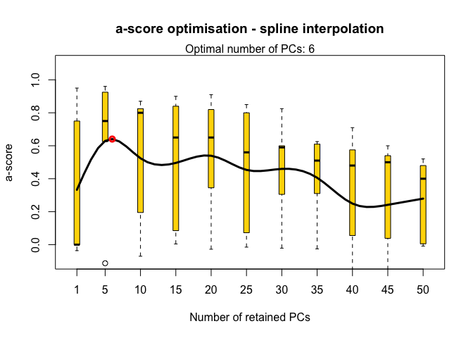<!-- -->

Kk let’s use 6 PCs

``` r
#run the DAPC again now we will just use 2 PCs
dapc1 <- dapc(gl.Bd, grp$grp, n.pca=6, n.da=2)
#to explore split
scatter(dapc1)
```

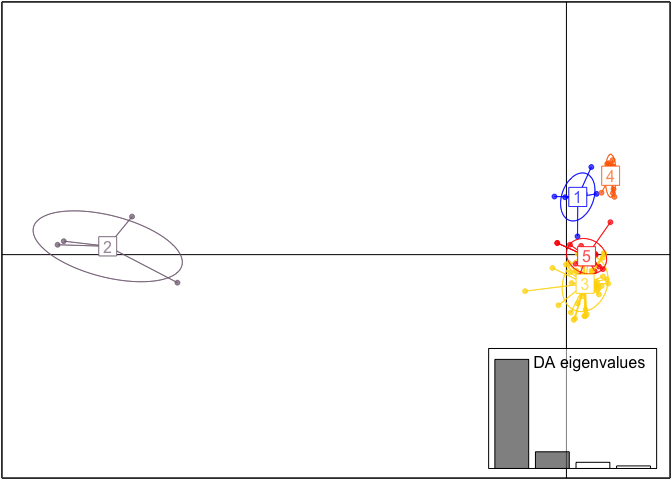<!-- -->

Now we get a more reasonable spread that isn’t overfit. However, we can
see that group 2 is very different than the other groups, so we may need
to revisit K=4.

``` r
#to see assignment probabilities for each cluster
assignplot(dapc1)
```

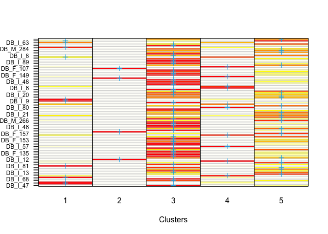<!-- -->

``` r
#add this assignment to the vcf.meta table
assign <- as_tibble(as.numeric(dapc1$assign))
vcf.meta <- cbind(vcf.meta, assign=assign$value)
```

We can see that samples with yellow boxes have lower probability of
being assigned to either group and that many within groups 1,3, 4, and 5
have high uncertainty. So let’s go back and redo the DAPC with K=2.

``` r
set.seed(42)
grp2 <- find.clusters(gl.Bd, n.clust=2, n.pca = 100, choose.n.clust = F, criterion = "diffNgroup")
#run the dapc with K=2 and many PCs
dapc2 <- dapc(gl.Bd, grp2$grp, n.pca=50, n.da=2)
scatter(dapc2)
```

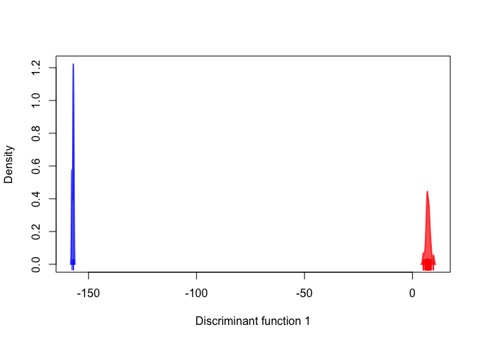<!-- -->

We can see that this seems to be overfit, so let’s find the optimal
number of PCs to use again.

``` r
#find the optimal number of PCs to use
temp <- optim.a.score(dapc2)
```

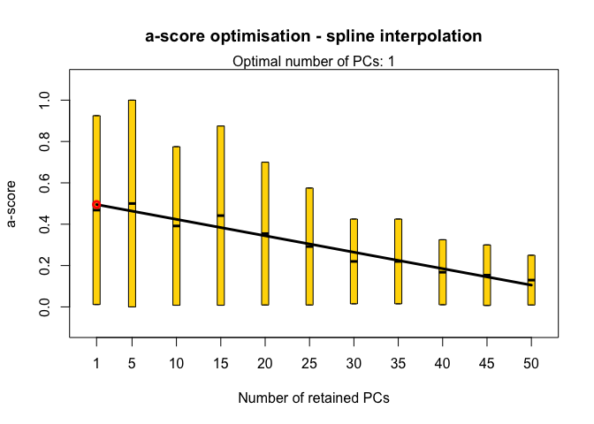<!-- -->

We see that the optimal number is 1 so let’s use two and plot again.

``` r
#we get one but let's use at least 2
dapc2 <- dapc(gl.Bd, grp2$grp, n.pca=2, n.da=2)
scatter(dapc2)
```

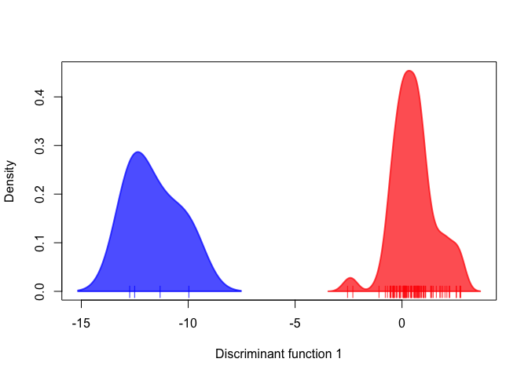<!-- -->

``` r
#now make a dataframe with the assignments
assign2 <- as_tibble(as.numeric(dapc2$assign))

#now let's add this assignment information to our meta file so we can use it in our PCA
vcf.meta <- cbind(vcf.meta, assign2=assign2$value)
```

Now we use these assignments and make a PCA to explore the relationship
of the samples.

``` r
#calculate PCA
pca <- glPca(gl.Bd, nf = 3)
#plot how much variance is explained by the subsequent PCs
barplot(100*pca$eig/sum(pca$eig), col = heat.colors(50), main="PCA Eigenvalues")
title(ylab="Percent of variance\nexplained", line = 2)
title(xlab="Eigenvalues", line = 1)
```

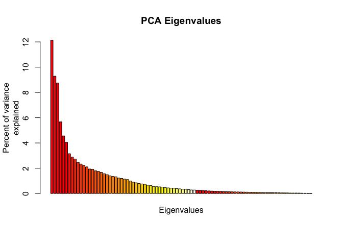<!-- -->

``` r
#PC1 explains 12.1% and PC2 explains 9.3%
```

Now let’s see what the PCA looks like.

``` r
pca.scores <- as.data.frame(pca$scores)
cols <- brewer.pal(n_distinct(vcf.meta$assign), "Set1")

#make the plot using ggplot and store in variable p 
#this plot uses the K=4 results
p <- ggplot(pca.scores, aes(x=PC2, y=PC1, colour=as.factor(vcf.meta$assign), shape=vcf.meta$Family)) + 
  geom_point(size=5) + 
  scale_color_manual(name = "Cluster", values = c("dark grey",cols[1],cols[2],cols[3],cols[4])) + 
  scale_shape_manual(name = "Family", values = c(0,2,4,6,8,10,12)) +
  stat_ellipse(aes(x=PC2, y=PC1, group=as.factor(vcf.meta$assign)),level = 0.95, size = 1) + 
  geom_hline(yintercept = 0) + 
  geom_vline(xintercept = 0) + 
  theme_bw()

#now plot
p
```

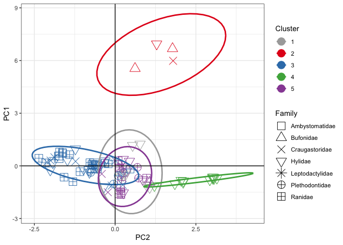<!-- -->

Ok now let’s compare to the PCA with K=2 colors

``` r
p2 <- ggplot(pca.scores, aes(x=PC2, y=PC1, colour=as.factor(vcf.meta$assign2), shape=vcf.meta$Family)) + 
  geom_point(size=5) + 
  scale_color_manual(name = "Cluster",values = c(cols[1],cols[2])) + 
  scale_shape_manual(name = "Family",values = c(0,2,4,6,8,10,12)) +
  stat_ellipse(aes(x=PC2, y=PC1, group=as.factor(vcf.meta$assign2)),level = 0.95, size = 1) + 
  geom_hline(yintercept = 0) + 
  geom_vline(xintercept = 0) + 
  theme_bw()

#now plot
p2
```

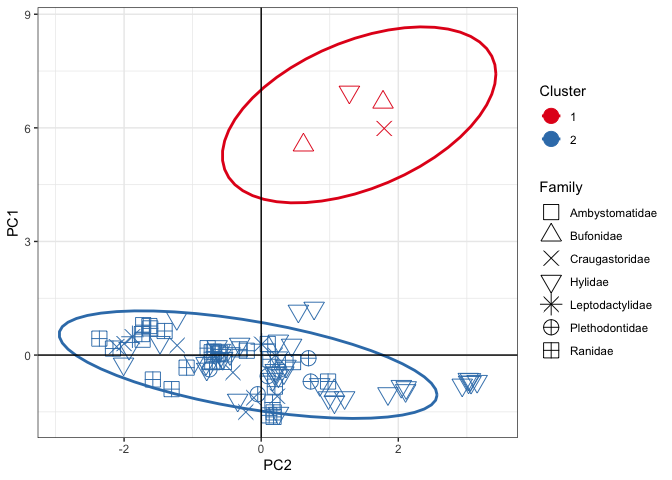<!-- -->

Now we can compare the results we just calculated with those published
in the [Molecular Ecology
Paper](https://onlinelibrary.wiley.com/doi/pdf/10.1111/mec.15733).

Looking at the paper we know that the main split we have in our sample
is GPL1 vs GPL2. So let’s use the GPL lineage information (included in
the metadata file to compare our results)

We can see that four samples in Cluster 1 are GPL2\!

**Run AMOVA to test variation of genetic data based on site or species**

AMOVA can use categorical “strata” and test whether these strata
correlate with the variation in your data.

Sourced from this
[tutorial](https://grunwaldlab.github.io/poppr/reference/poppr.amova.html)

``` r
#convert to genind for analysis
mx_genind <- vcfR2genind(Bd.VCF)

#set strata as site and species
mx_strata <- data.frame(cbind(vcf.meta$State,vcf.meta$Family, 
paste(vcf.meta$State,vcf.meta$Family, sep="_")))
colnames(mx_strata) <- c("State","Family","State_Family")
strata(mx_genind) <- mx_strata
mx_genclone <- as.genclone(mx_genind)

#check out sample numbers for eacch of our strata
table(strata(mx_genclone, ~State/Family, combine = FALSE))
```

    ##                   Family
    ## State              Ranidae Hylidae Plethodontidae Craugastoridae Ambystomatidae
    ##   Guanajuato             4       2              0              0              0
    ##   Baja California        1      23              0              0              0
    ##   Chiapas                1       7              3              4              0
    ##   Michoacán              8       0              0              0              1
    ##   Veracruz               2       6              2              3              0
    ##   Hidalgo                2       0              0              0              0
    ##   Mexico City            4       0              0              0              0
    ##   Oaxaca                 0       3              0              1              0
    ##   Colima                 2       0              0              0              0
    ##   Guerrero               1       0              0              0              0
    ##   Estado de México       1       0              0              0              0
    ##   San Luis Potosí        1       0              0              0              0
    ##   Querétaro              1       0              0              0              0
    ##   Tlaxcala               0       0              1              0              0
    ##                   Family
    ## State              Bufonidae Leptodactylidae
    ##   Guanajuato               0               0
    ##   Baja California          3               0
    ##   Chiapas                  1               0
    ##   Michoacán                0               0
    ##   Veracruz                 0               0
    ##   Hidalgo                  0               0
    ##   Mexico City              0               0
    ##   Oaxaca                   0               0
    ##   Colima                   0               1
    ##   Guerrero                 0               2
    ##   Estado de México         0               0
    ##   San Luis Potosí          0               0
    ##   Querétaro                0               0
    ##   Tlaxcala                 0               0

Now let’s run the AMOVA.

``` r
#run amova
mx_amova <- poppr.amova(mx_genclone, ~State/Family)
```

    ## 
    ## Found 6605 missing values.
    ## 
    ## 245 loci contained missing values greater than 5%
    ## 
    ## Removing 245 loci: 2_27, 2_30, 3_10, 3_20, 3_30, 3_56, 3_68, 3_75,
    ## 3_85, 3_100, 3_112, 3_132, 7_29, 7_41, 7_146, 9_55, 11_21, 11_64,
    ## 13_94, 15_137, 16_23, 16_82, 16_137, 19_32, 19_41, 19_42, 20_14, 20_90,
    ## 22_40, 22_57, 22_65, 22_79, 22_99, 22_121, 24_30, 24_56, 24_67, 24_75,
    ## 24_81, 24_107, 26_33, 26_38, 26_101, 28_63, 29_2, 29_15, 29_17, 29_78,
    ## 32_16, 32_36, 32_48, 32_55, 32_72, 32_125, 33_99, 37_40, 39_57, 39_102,
    ## 39_123, 42_51, 42_62, 45_92, 46_20, 46_80, 46_91, 51_14, 51_63, 51_92,
    ## 51_134, 53_16, 53_51, 53_81, 56_34, 56_107, 58_103, 59_64, 59_68,
    ## 59_82, 59_114, 60_50, 66_81, 68_11, 68_58, 68_91, 68_128, 70_50, 71_13,
    ## 71_48, 73_19, 77_6, 77_40, 77_43, 77_48, 81_37, 81_110, 81_112, 83_78,
    ## 83_102, 89_15, 89_77, 89_82, 89_94, 89_95, 89_111, 89_141, 91_27,
    ## 92_97, 92_112, 94_55, 94_120, 96_85, 96_98, 97_3, 99_22, 99_75, 99_81,
    ## 100_108, 100_121, 100_123, 100_132, 101_30, 101_99, 101_104, 103_42,
    ## 104_41, 104_46, 106_40, 106_41, 106_50, 106_137, 109_33, 109_65,
    ## 109_103, 109_112, 109_131, 113_49, 113_109, 113_141, 114_77, 115_16,
    ## 115_79, 115_97, 117_110, 118_56, 118_71, 118_123, 121_27, 122_63,
    ## 122_116, 124_56, 124_107, 127_19, 127_22, 127_44, 127_80, 129_14,
    ## 129_22, 129_62, 129_129, 131_12, 131_13, 131_47, 131_58, 133_7, 133_30,
    ## 133_47, 133_90, 138_154, 139_43, 139_76, 139_117, 143_18, 143_67,
    ## 148_45, 148_74, 148_139, 152_13, 152_32, 152_59, 152_73, 157_44,
    ## 160_76, 163_77, 163_102, 164_15, 169_41, 169_56, 169_81, 170_112,
    ## 170_135, 174_52, 174_55, 175_104, 181_13, 181_18, 187_15, 187_91,
    ## 189_65, 190_49, 195_27, 195_112, 195_155, 196_5, 196_22, 196_74,
    ## 196_88, 198_7, 198_71, 198_102, 198_123, 198_137, 212_26, 212_114,
    ## 212_127, 212_140, 214_16, 214_64, 214_83, 222_20, 222_50, 222_60,
    ## 222_85, 222_145, 225_19, 225_77, 225_133, 225_134, 226_37, 226_52,
    ## 226_131, 226_142, 227_128, 227_141, 232_136, 233_21, 233_108, 240_6,
    ## 242_6, 242_12, 242_28, 242_37, 242_41, 242_53, 242_98, 242_138

    ## Warning in poppr.amova(mx_genclone, ~State/Family): Data with mixed ploidy or ambiguous allele dosage cannot have within-individual variance calculated until the dosage is correctly estimated.
    ## 
    ##  This function will return the summary statistic, rho (Ronfort et al 1998) but be aware that this estimate will be skewed due to ambiguous dosage. If you have zeroes encoded in your data, you may wish to remove them.
    ##  To remove this warning, use within = FALSE

    ## Distance matrix is non-euclidean.

    ## Using quasieuclid correction method. See ?quasieuclid for details.

``` r
#check it out
mx_amova
```

    ## $call
    ## ade4::amova(samples = xtab, distances = xdist, structures = xstruct)
    ## 
    ## $results
    ##                              Df    Sum Sq  Mean Sq
    ## Between State                13  608.0313 46.77164
    ## Between samples Within State 14  511.9985 36.57132
    ## Within samples               63 1472.6818 23.37590
    ## Total                        90 2592.7115 28.80791
    ## 
    ## $componentsofcovariance
    ##                                               Sigma          %
    ## Variations  Between State                 0.8475147   2.884609
    ## Variations  Between samples Within State  5.1571617  17.552962
    ## Variations  Within samples               23.3759009  79.562429
    ## Total variations                         29.3805774 100.000000
    ## 
    ## $statphi
    ##                          Phi
    ## Phi-samples-total 0.20437571
    ## Phi-samples-State 0.18074336
    ## Phi-State-total   0.02884609

Now we can run a significance test to get a p-value for our comparisons.

``` r
#run significance test
set.seed(1989)
mx_signif   <- randtest(mx_amova, nrepet = 999)
plot(mx_signif)
```

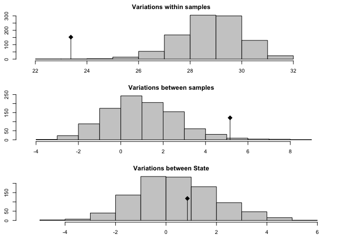<!-- -->

``` r
mx_signif
```

    ## class: krandtest lightkrandtest 
    ## Monte-Carlo tests
    ## Call: randtest.amova(xtest = mx_amova, nrepet = 999)
    ## 
    ## Number of tests:   3 
    ## 
    ## Adjustment method for multiple comparisons:   none 
    ## Permutation number:   999 
    ##                         Test        Obs    Std.Obs   Alter Pvalue
    ## 1  Variations within samples 23.3759009 -4.4821282    less  0.002
    ## 2 Variations between samples  5.1571617  2.4558401 greater  0.017
    ## 3   Variations between State  0.8475147  0.2822244 greater  0.375

From this we can see that a low proportion of variance (17.6%) is
explained by variations between samples (i.e. Family) within a State and
the p-value is significant, however most of the variation is within
samples (or unstructured).

**Calculate heterozygosity among different assigned genotypes**

First, I use the program vcftools to run the following command on my
input vcf:

> ./vcftools –vcf delia\_freebayes\_mexico.vcf –het –out mx\_Bd

This gave me the output called “mx\_Bd.het” which I will read in here.

``` r
#read in
het_all <- read_delim("mx_Bd.het", delim = "\t",
           col_names = c("Sample_ID","ho", "he", "nsites", "f"), skip = 1)
```

    ## 
    ## ── Column specification ────────────────────────────────────────────────────────
    ## cols(
    ##   Sample_ID = col_character(),
    ##   ho = col_double(),
    ##   he = col_double(),
    ##   nsites = col_double(),
    ##   f = col_double()
    ## )

``` r
#join to other metadata
left_join(het_all, vcf.meta, by = "Sample_ID") -> vcf.meta.het
vcf.meta.het <- mutate(vcf.meta.het, ho_calc=1-(ho/nsites))

#plot by genotype
pb <- ggplot(vcf.meta.het, aes(x=as.factor(GPL_lineage), y=ho_calc, color=as.factor(GPL_lineage))) + 
  geom_boxplot()+
  xlab("Genotype")+
  ylab("Individual Heterozygosity")+
  scale_color_manual(values = c(cols[2],cols[1],"dark grey")) +
  geom_signif(comparisons = list(c("1","2")), map_signif_level=T)+
  theme_bw()

pb + geom_dotplot(binaxis='y', stackdir='center', dotsize=0.5)
```

    ## Bin width defaults to 1/30 of the range of the data. Pick better value with `binwidth`.

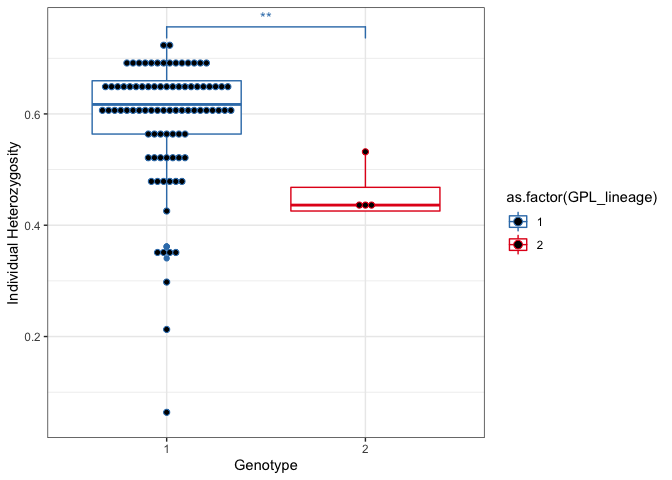<!-- -->

``` r
#here ** means the p-value is significant at the 0.01 level. 
#GPL1 has significantly higher heterozygosity than GPL2
```

**Calculate pairwise genetic distance and plot vs geographic distance**

``` r
#calculate pairwise genetic distance
mx.dist <- poppr::bitwise.dist(mx_genclone, mat=T)

#calcualte geo dist
mx_pts <- cbind(vcf.meta$Sample_ID,vcf.meta$Lat,vcf.meta$Lon)
colnames(mx_pts) <- c("name","lat","lon")
write.csv(mx_pts, file="mx_geo_pts.csv")
samples_loc_mx <- read.csv("mx_geo_pts.csv", header = T)
#functions for calculating geo dist
ReplaceLowerOrUpperTriangle <- function(m, triangle.to.replace){
   # If triangle.to.replace="lower", replaces the lower triangle of a square matrix with its upper triangle.
   # If triangle.to.replace="upper", replaces the upper triangle of a square matrix with its lower triangle.
   if (nrow(m) != ncol(m)) stop("Supplied matrix must be square.")
   if      (tolower(triangle.to.replace) == "lower") tri <- lower.tri(m)
   else if (tolower(triangle.to.replace) == "upper") tri <- upper.tri(m)
   else stop("triangle.to.replace must be set to 'lower' or 'upper'.")
   m[tri] <- t(m)[tri]
   return(m)
}
GeoDistanceInMetresMatrix <- function(df.geopoints){
   # Returns a matrix (M) of distances between geographic points.
   # M[i,j] = M[j,i] = Distance between (df.geopoints$lat[i], df.geopoints$lon[i]) and
   # (df.geopoints$lat[j], df.geopoints$lon[j]).
   # The row and column names are given by df.geopoints$name.
   GeoDistanceInMetres <- function(g1, g2){
      # Returns a vector of distances. (But if g1$index > g2$index, returns zero.)
      # The 1st value in the returned vector is the distance between g1[[1]] and g2[[1]].
      # The 2nd value in the returned vector is the distance between g1[[2]] and g2[[2]]. Etc.
      # Each g1[[x]] or g2[[x]] must be a list with named elements "index", "lat" and "lon".
      # E.g. g1 <- list(list("index"=1, "lat"=12.1, "lon"=10.1), list("index"=3, "lat"=12.1, "lon"=13.2))
      DistM <- function(g1, g2){
         require("Imap")
         return(ifelse(g1$index > g2$index, 0, gdist(lat.1=g1$lat, lon.1=g1$lon, lat.2=g2$lat, lon.2=g2$lon, units="m")))
      }
      return(mapply(DistM, g1, g2))
   }
   n.geopoints <- nrow(df.geopoints)
   # The index column is used to ensure we only do calculations for the upper triangle of points
   df.geopoints$index <- 1:n.geopoints
   # Create a list of lists
   list.geopoints <- by(df.geopoints[,c("index", "lat", "lon")], 1:n.geopoints, function(x){return(list(x))})
   # Get a matrix of distances (in metres)
   mat.distances <- ReplaceLowerOrUpperTriangle(outer(list.geopoints, list.geopoints, GeoDistanceInMetres), "lower")
   # Set the row and column names
   rownames(mat.distances) <- df.geopoints$name
   colnames(mat.distances) <- df.geopoints$name
   return(mat.distances)
}

#calculate the distance matrix

distance.mat.m.mx <- GeoDistanceInMetresMatrix(samples_loc_mx)

#check the dimensions (these should match)
dim(mx.dist)
```

    ## [1] 91 91

``` r
dim(distance.mat.m.mx)
```

    ## [1] 91 91

``` r
geo_dist_mx <- distance.mat.m.mx[lower.tri(distance.mat.m.mx)]
gen_dist_mx <- mx.dist[lower.tri(mx.dist)]

#for plotting a linear model on the data
gen_dist_dist_mx <- as.dist(mx.dist)
geo_km_dist_dist_mx <- as.dist(distance.mat.m.mx)
mx_lm <- lm(gen_dist_dist_mx ~ geo_km_dist_dist_mx)
#intercept
intercept <- mx_lm$coefficients[1]
#slope for km
slope <- mx_lm$coefficients[2]*1000

#now we can plot
plot(geo_dist_mx/1000, gen_dist_mx, xlab="Geographic Distance (km)", ylab="Genetic Distance")
abline(intercept, slope, col = "red", lty = 3, lwd=2)
```

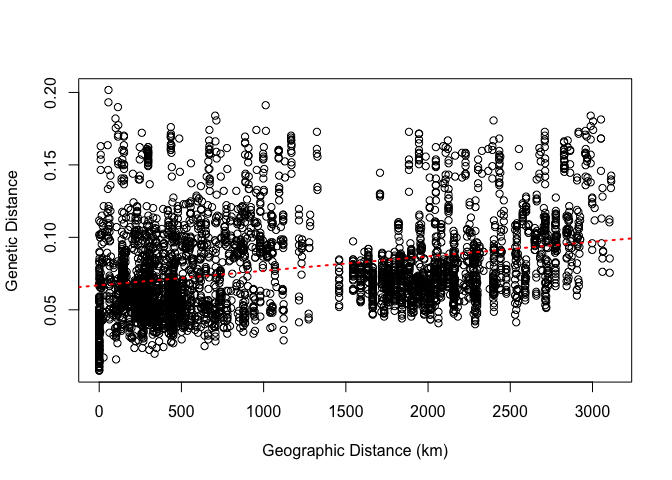<!-- -->

Finally we can run a mantel test to see if geo and genetic distances are
correlated in this system.

``` r
#mantel test
mantel(distance.mat.m.mx, mx.dist)
```

    ## 
    ## Mantel statistic based on Pearson's product-moment correlation 
    ## 
    ## Call:
    ## mantel(xdis = distance.mat.m.mx, ydis = mx.dist) 
    ## 
    ## Mantel statistic r: 0.2909 
    ##       Significance: 0.001 
    ## 
    ## Upper quantiles of permutations (null model):
    ##    90%    95%  97.5%    99% 
    ## 0.0589 0.0768 0.0939 0.1178 
    ## Permutation: free
    ## Number of permutations: 999

Now we can see that there is a correaltion betwen Bd genetic distance
and geographic distance (r = 0.2909) and it is significant.

**Plotting genotypes/clusters on a map**

``` r
#plot base map range and scale
maps::map(database=ne_countries(country = "mexico", type = "countries"))
maps::map.scale(relwidth = 0.1, metric = TRUE, ratio = F, cex=0.5,y=max(vcf.meta$Lat)+.4, x=-104)
#add the points to the map and color based on DAPC assignment.
points(x = vcf.meta$Lon, y = vcf.meta$Lat, col = cols[as.factor(vcf.meta$assign2)], pch=16, cex=1.5)
#to replot GPL2 samples on top of GPL1
#find the index for the four GPL2 samples
GPL2_index <- which(vcf.meta$GPL_lineage=="2")
points(y = vcf.meta[GPL2_index,"Lat"], x = vcf.meta[GPL2_index,"Lon"], col = cols[1], pch=16, cex=1.5)
```

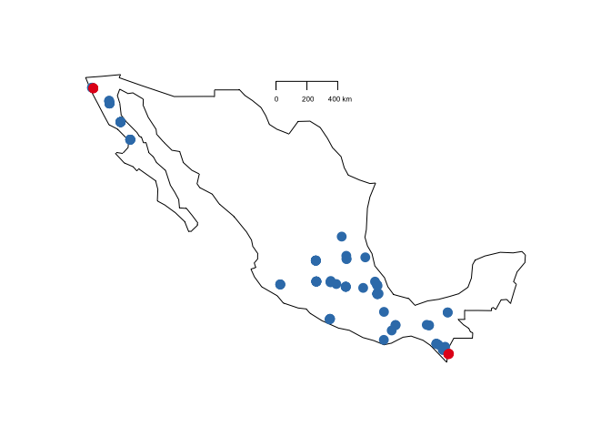<!-- -->

``` r
#looks great! 
```

**END TUTORIAL**
